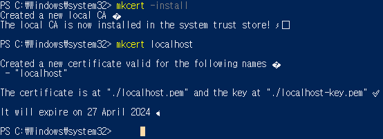
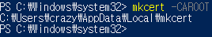
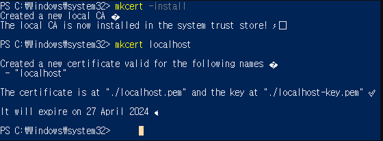

## 로컬 환경에서 https 로 서버 켜기

<hr>

1. [이곳](https://chocolatey.org/install) 에 나온데로 chocolate 설치 (파워쉘은 관리자모드로).

2. [이곳](https://github.com/FiloSottile/mkcert#installation) 에 나온데로 mkcert 설치 (마찬가지로 파워쉘은 관리자모드).

3. 이후 아래 사진과 같이 명령어 입력 (파워쉘)

   

4. 이제 CA 와 SSL 인증서 설치 완료. 
   저장 위치가 궁금하면 아래와 같이 확인 가능

   

5. 프로젝트 `frontend-end` 파일의 루트 위치에 `server.js` 파일을 하나 만들고 아래 내용을 복붙.
   `key` 와 `cert` 는 로컬 디렉토리를 새로 입력.

```jsx
// server.js

const { createServer } = require("https");
const { parse } = require("url");
const next = require("next");
const fs = require("fs");
const port = 3000;
const dev = process.env.NODE_ENV !== "production";
const app = next({ dev });
const handle = app.getRequestHandler();

const httpsOptions = {
    key: fs.readFileSync("C:/Users/crazy/AppData/Local/mkcert/rootCA-key.pem"),
    cert: fs.readFileSync("C:/Users/crazy/AppData/Local/mkcert/rootCA.pem")
};

app.prepare().then(() => {
    createServer(httpsOptions, (req, res) => {
        const parsedUrl = parse(req.url, true);
        handle(req, res, parsedUrl);
    }).listen(port, (err) => {
        if (err) throw err;
        console.log("ready - started server on url: <https://localhost>:" + port);
    });
});
```


6. vsc 터미널 창에다 `node server.js` 라고 치시면 https 서버로 켜지.. 지 않음.


예상했던 데로 한번에 **안됨..**

다.행.히 뭘 잘못했는지 파악, 해결 방법도 찾음 **↓**

------

# continue:

7. 보안상 이유인지 모르지만, root CA (certificate authority) 는 직접적으로 활용하면 안되고, 
   고로 `rootCA.pem` 파일도 직접적으로 참조하면 안된다 함. 
   [참고](https://github.com/FiloSottile/mkcert/issues/253) 
   고로, `server.js` 의 `key` 와 `cert` 의 참조 `.pem` 파일 디레토리를  아래 사진에 명시된 위치로 바꾸어주니 무사히 https 가 적용된 로컬 서버 정상 작동.



최종 `server.js` ↓

```jsx
const { createServer } = require('https');
const { parse } = require('url');
const next = require('next');
const fs = require('fs');

const dev = process.env.NODE_ENV !== 'production';
const app = next({ dev });
const handle = app.getRequestHandler();

const httpsOptions = {
  key: fs.readFileSync("C:/Windows/system32/localhost-key.pem"),
  cert: fs.readFileSync("C:/Windows/system32/localhost.pem")
};

app.prepare().then(() => {
  createServer(httpsOptions, (req, res) => {
    const parsedUrl = parse(req.url, true);
    handle(req, res, parsedUrl);
    
  }).listen(3000, err => {
    if (err) throw err;
    console.log('> Ready on <https://localhost:3000>');
  });
});
```

짝짝짝..