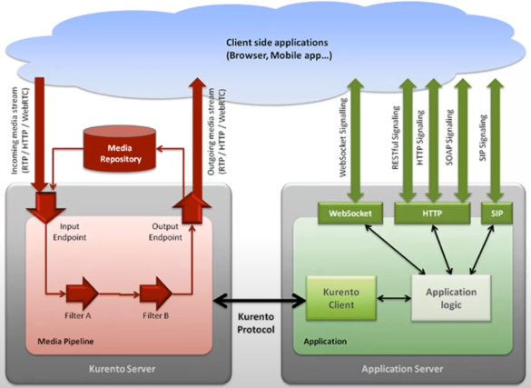

[참고 글](https://www.kurento.org/whats-kurento#:~:text=Kurento is a WebRTC media,and routing of audiovisual flows.)   /   [참고 영상](https://www.youtube.com/watch?v=ztEouABEUzY)

 

### What is Kurento?

- 오픈 소스
- WebRTC를 위한 media server
- 다양한 media transformation 기능 보유
- MCU (Multipoint Conferencing Unit) by design
- Node.js, JavaScript, Java, 및 다양한 언어 지원
- 

 

### Why use Kurento?

- 다양한 endpoint 활용 가능 (필터링 레이오버, 바코드 인식, 등)

  

- 타 WebRTC 개발 라이브러리 대비, 비디오 채팅 구현을 위한 종합 세트 느낌

  

  