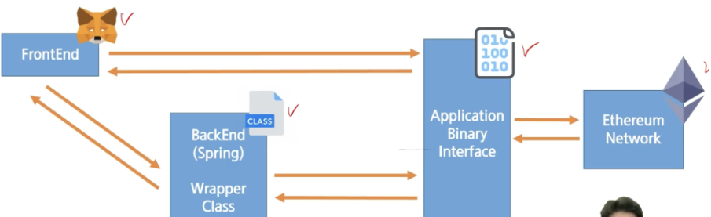
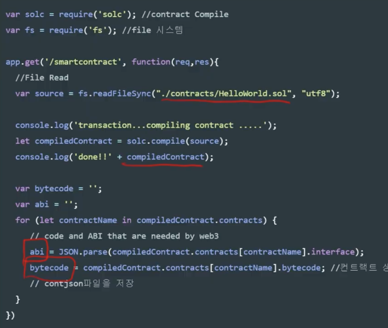
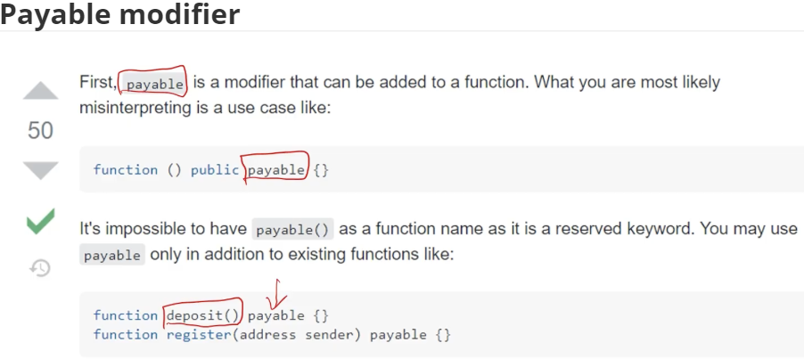

# 블록체인 구조 뜯어보기

<hr>

<br>

## 어떤 체인을 사용할 것인가?

<br>

### Public Chain

:white_check_mark: 누구나 접근 가능하다

:white_check_mark: 진정한 의미의 탈중앙화라는 장점이 있음

:white_check_mark: 한편으로는 데이터를 저장하는 것이 매우 비싸고

:white_check_mark: Transaction이 발생할 때마다 비용을 지불해야 한다

:white_check_mark: 다소 복잡한 Smart Contract의 배포 비용 (0.5 ETH) = 200백만원

<br>

### 이더리움의 장점

:white_check_mark: Middle man의 제거가 가능해짐

:white_check_mark: 닷컴 버블 이후 가장 성장한 비즈니스는 광고 플랫폼 등 Middle man이 필요한 산업

:white_check_mark: Smart Contract은 바로 이 Middle man의 개입 없이 공정한 분배가 이루어질 수 있음

<br>

### 오라클 문제

:white_check_mark: Oracle이란 블록체인 밖의 데이터를 블록체인 안(On-chain)으로 가져오는 것을 의미함

:white_check_mark: 비가 오면 John에게 10$를 주겠다 => 비가 왔다는 정보 (oracle 문제 발생)

:white_check_mark: 주사위를 던져서 3보다 큰 수가 나오면 1$를 지불한다 => 코드로 구현 가능

:white_check_mark: 10월 11일 되면 이 빌딩의 소유권을 Paul에게 양도한다 => 10월 11일 되었다는 정보 (oracle 문제 발생)

<br>

### Pivate Chain

:white_check_mark: DB에 준하는 빠른 속도

:white_check_mark: 사전에 약속된 사용자만 참여 가능

:white_check_mark: 주로 Hyperledger fabric을 사용한다

:white_check_mark: 사용자가 인지할 수 없는 사이에 블록체인 활용 가능

<br>

### 이더리움 프로젝트를 구조를 이해 해보자

> 프론트와 백엔드에서 이더리움과 통신이 가능하다



<br>

### 메타마스크

:white_check_mark: 쉽게 사용할 수 있는 크롬 익스텐션

:white_check_mark: Key를 보관하고 서명을 안전하게 하는 역할을 한다

:white_check_mark:  Web3를 이용해서 쉽게 서명할 수 있다.

:white_check_mark:  개발자는 추상화된 API를 이용해서 쉽게 개발 가능 

<br>

## 프론트엔드에서 블록체인과 통신하는 법

:white_check_mark: Web3.js를 이용한다

:white_check_mark: 직접 private key를 이용해서 서명하는 것도 가능하지만

:white_check_mark:  metamask와 같은 서비스를 이용하는 것이 안전함

:white_check_mark:  다른 사람의 지갑 주소로 ETH를 전송하거나

:white_check_mark:  Smart Contract과 통신해서 데이터를 받아오는 것도 가능

<br>

## ABI (Applciation Binary Interface)

:white_check_mark:  API랑 좀 닮지 않았습니까?

:white_check_mark:  Binary 형태로 컴파일된 Smart Contract과 통신하기 위한 Interface

<br>

### 컴파일 된 바이너리의 모습


<br>

### How to build?  Use solc



<br>

:white_check_mark: bytecode와 api를 이용해서 deploy 한다

```javascript
const MyContract = new web3.eth.Contract(abi)

let deploy = MyContract.deploy({
  			data: bytecode,
  			from: send_account}).encodeABI();
```

<br>

## Payable modifier



<br>

## Payable modifier

:white_check_mark: 이더리움에 깔려있는 전제가 하나 있다

:white_check_mark: 핵심 로직은 이더리움을 이용한 결제를 통해 발생한다

:white_check_mark: 이더리움으이 스마트 컨트랙에 입금될 떄의 로직을 만들고 싶다면?

:white_check_mark: payable modifier를 붙여준다면 구현 가능하다!

:white_check_mark: (이더리움) 모임 통장 만들기, 경매, 안전 거래 등

:white_check_mark: 대부분의 핵심 로직은 payable modifier를 이용해서 구현한다

:white_check_mark: NFT의 경우 ERC-20으로 구매할 것이므로 불필요


### Q. 블록체인에 영상을 저장하고 싶어요

:white_check_mark: 이더리움의 블록 크기는 1~8MB 수준

:white_check_mark: 여기에 영상을 저장할 수 있을까?

:white_check_mark: 텍스트 형태의 데이터라도 200개 이상 저장하는 것이 어렵다

:white_check_mark: 그렇다면 어떤 방법이 있을까?

:white_check_mark: 일반적으로 파일을 정합성을 확인할 때는 해시값을 이용한다

:white_check_mark: 동영상의 해시값을 블록체인에 저장한다면?

- public chain은 동영상 저장하는 것이 불가능하다

> 원본을 통째로 저장하는 것은 불가능하다


### 이더리움 vs 자체 코인

:white_check_mark: 화폐의 가치는 어떻게 결정되는가?

:white_check_mark: 화폐를 사람들이 얼마나 신용하는지에 따라서 결정된다

:white_check_mark: 코인의 가치 혹은 블록체인의 가치도 사람들의 신용도에 따라서 결정

:white_check_mark: 이더리움은 많은 사람들이 사용하기 때문에 신용도가 높고 가치도 높다

:white_check_mark: 우리가 만든 자체 코인은 자유도가 높지만 신용도는 매우 낮을 것


## Wrapper Class

:white_check_mark: Web3j를 이용해서 Smart Contract와 통신하기 위해서는 Wrapper Class를 생성해야 한다

:white_check_mark: Compile된 Binary로부터 Wrapper Class를 생성함

:white_check_mark: Compile된 Binary가 조금이라도 변경되면 Wrapper Class를 다시 만들어야 한다.

:white_check_mark: 주석, 공백을 포함해서 어떤 것이 바뀌어도 Wrapper Class는 다시 만들어야 한다

:white_check_mark: Jenkins 같은 자동화된 빌드 도구를 사용하는 것이 좋은 방법이다


## 유저가 블록체인을 불편해 할 때?

:white_check_mark: 서비스 제공자가 사용자 별로 키를 보관하고 관리해줄 수 있다

:white_check_mark: 신규 유저가 생기면 지갑을 생성하고 보관한다

:white_check_mark: 로그인 인증을 통해서 유저를 확인하고 대신 서명을 한다

:white_check_mark: 일반적인 거래소들이 많이 활용하는 방법

:white_check_mark: 대부분의 유저들에게 블록체인을 이해시키기 어렵기 떄문에 사용한다


## 프론트엔드 vs 백엔드 어디서 처리할까?

:white_check_mark: 완전한 탈중앙화를 추구한다면 프론트엔드에서 유저에게 서명하는 것이 옳다

:white_check_mark: 유저입장에서는 블록체인에 익숙하지 않기 때문에 서비스를 백엔드에서 관리하는 것도 좋다


## 어떤 네트워크를 사용할 것인가?

:white_check_mark: SUB PJT1에 했던 것들이 무엇이었을까?

:white_check_mark: 우리만 사용할 수 있는 Private Network를 구성한 것!

:white_check_mark: Infura와 같은 Public하게 구성된 테스트넷들이 많이 있다

:white_check_mark: 실제로 이더리움 메인넷과 동일한 환경인 테스트넷을 사용하는 것이 가능하다

:white_check_mark: 실 서비스를 운영한다면 이더리움 메인넷에 배포해야 할 것


## Public network를 쓸 때의 장점

> 어떤 함수를 사용했고, 어떤 파라미터를 사용했고, 실행 된 binary를 볼 수 있다.
>
> 디버깅이 가능하다


