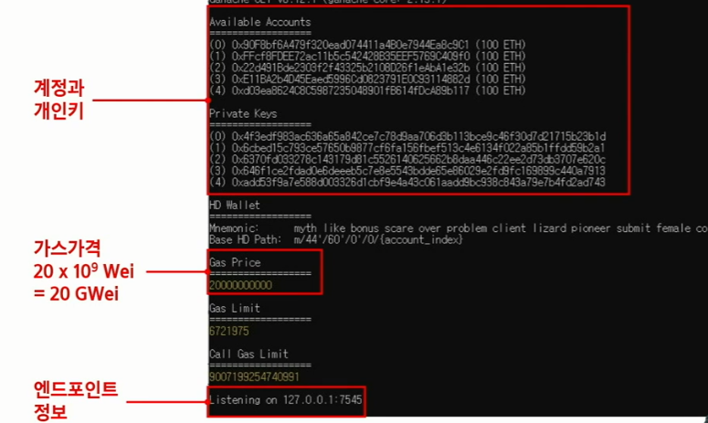
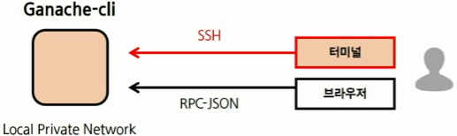
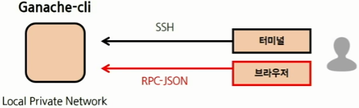

### 로컬 테스트넷 구동

- 직접 pc를 이더리움 블록체인으로 구동

- `ganache-cli -d -m -p 7545 -a 5`

  7545포트에 가나슈로부터 5개의 테스트할 수 있는 이더리움 계정(+프라이빗 키) 받음

- `Gas` == 수수료

- 명령어 옵션 확인 => `ganache-cli --help`

  

 

### 가짜 이더리움 블록체인에 연결해서 직접 이더를 보내보고 받아보고 실습

1. `geth` 명령어로 가나슈 테스트넷에 접속 (새로운 cmd 에서 실행)

   `geth attach http://localhost:7545`

   현재 상태 : 

2. 다양한 명령어로 확인 가능

   - 연결성 확인 => `net.listening`
   - 내 피어 인원 확인 => `net.peerCount`
   - 보유한 계정 확인 => `eth.accounts`
   - 계정마다 보유 잔액 확인 => `web3.fromWei(eth.getBalance(eth.accounts[0]))`

   상황 정리 : `geth` 클라이언트 통해 `가나슈`에 접촉해서 직접 `이더리움`을 구동함

 

### `Metamask` 통해 가나슈 블록체인으로 연결

1. 브라우저 상의 metamask에서 네트워크 추가 클릭

2. `geth concole` 에서 chainId 확인 => `eth.chainId()`

3. 네트워크 생성

   상황 정리 : 

   메타마스크를 통해서 브라우저로 연결됨. 

 

### 가나슈로 만든 계정에서 메타마스크 계정으로 이더리움을 보내보자

1. `geth console`로 진행

   `tx = { from: "가나슈_제공_계정_한개", to: "메타마스크_계정", value: 1e18}`

   `eth.sendTransaction(tx)`

2. metamask 에서 송금 확인

   브라우저에서 확인

3. geth concole 에서 송금 확인

   `eth.getTransaction(transactionHash)`

   `eth.getTransactionReceipt(transactionHash)`

   `eth.getBalance(eth.accounts[0])` => 콘솔에서 잔액 확인

   복잡한 잔액은 wei 라는 단위 이기 떄문.

   이더 단위로 보고 싶으면 => `web3.fromWei(eth.getBalance(eth.accounts[0]), "ether")`

### 정리

- 이더리움 블록체인에 대한 private 네트워크에 대한 이해
- `geth` 클라이언트를 통해 이더리움을 네트워크에 접속해봄
- 우리만의 네트워크를 운영할 수 있는 `ganache-cli`
- 대중적인 metamask 라는 지갑을 통해 우리만의 블록체인에 연결해서 직접 ether를 주고받음 

다양한 이더리움 블록체인 명령어 참조 링크 `https://github.com/ethereum/web3.js/blob/0.20.7/DOCUMENTATION.md`